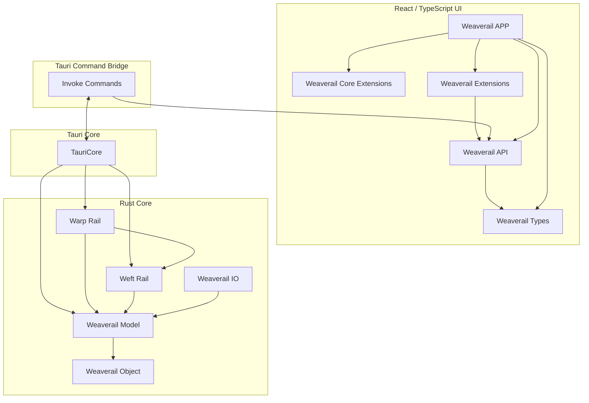

# Architecture of Weaverail

Weaverailアーキテクチャ概要図

## コンポーネント定義

### Backend (Rust)

- weaverail
	Tauriを用いたFrontendとのインタフェースを担うクレート
- warp-rail
	ダイヤグラム上のY座標を求めるクレート
- weaverail-io
	プロジェクトファイルの入出力を担うクレート
- weaverail-model
	Weaverailで用いるデータ構造を定義するクレート
- weaverail-object
	データ構造定義で用いるヘルパ関数を定義するクレート
- weft-rail
	各種制約から列車時刻を算出するクレート

### Frontend (React+TypeScript)

- @weaverail/api
	Tauriを用いたBackendとのインタフェースを担うパッケージ
- @weaverail/app
	Tauriを用いたUIの管理を担うパッケージ
- @weaverail/core-extensions
	Weaverailに含まれるコア拡張機能の実装パッケージ
- @weaverail/extensions
	Weaverailで用いる拡張機能を定義するパッケージ
- @weaverail/types
	Weaverailで用いるデータ構造を定義するパッケージ
