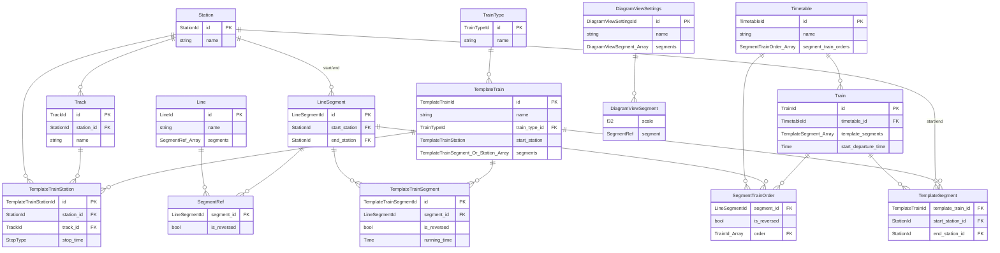

# Data Model of Weaverail

```mermaid
erDiagram

Station {
	StationId id PK
	string name
}

Track {
	TrackId id PK
	StationId station_id FK
	string name
}
Station ||--o{ Track : ""

LineSegment {
	LineSegmentId id PK
	StationId start_station FK
	StationId end_station FK
}
Station ||--o{ LineSegment : "start/end"

Line {
	LineId id PK
	string name
	SegmentRef_Array segments
}
Line ||--o{ SegmentRef : ""

SegmentRef {
	LineSegmentId segment_id FK
	bool is_reversed
}
LineSegment ||--o{ SegmentRef : ""

TrainType {
	TrainTypeId id PK
	string name
}

TemplateTrain {
	TemplateTrainId id PK
	string name
	TrainTypeId train_type_id FK
	TemplateTrainStation start_station
	TemplateTrainSegment_Or_Station_Array segments
}
TrainType ||--o{ TemplateTrain : ""

TemplateTrainSegment {
	TemplateTrainSegmentId id PK
	LineSegmentId segment_id FK
	bool is_reversed
	Time running_time
}
LineSegment ||--o{ TemplateTrainSegment : ""
TemplateTrain ||--o{ TemplateTrainSegment : ""

TemplateTrainStation {
	TemplateTrainStationId id PK
	StationId station_id FK
	TrackId track_id FK
	StopType stop_time
}
Station ||--o{ TemplateTrainStation : ""
Track ||--o{ TemplateTrainStation : ""
TemplateTrain ||--o{ TemplateTrainStation : ""

Timetable {
	TimetableId id PK
	string name
	SegmentTrainOrder_Array segment_train_orders
}
Timetable ||--o{ SegmentTrainOrder : ""

SegmentTrainOrder {
	LineSegmentId segment_id FK
	bool is_reversed
	TrainId_Array order FK
}
LineSegment ||--o{ SegmentTrainOrder : ""
Train ||--o{ SegmentTrainOrder : ""

Train {
	TrainId id PK
	TimetableId timetable_id FK
	TemplateSegment_Array template_segments
	Time start_departure_time
}
Timetable ||--o{ Train : ""
Train ||--o{ TemplateSegment : ""

TemplateSegment {
	TemplateTrainId template_train_id FK
	StationId start_station_id FK
	StationId end_station_id FK
}
Station ||--o{ TemplateSegment : "start/end"
TemplateTrain ||--o{ TemplateSegment : ""

DiagramViewSettings {
	DiagramViewSettingsId id PK
	string name
	DiagramViewSegment_Array segments
}
DiagramViewSettings ||--o{ DiagramViewSegment : ""

DiagramViewSegment {
	f32 scale
	SegmentRef segment
}
```
